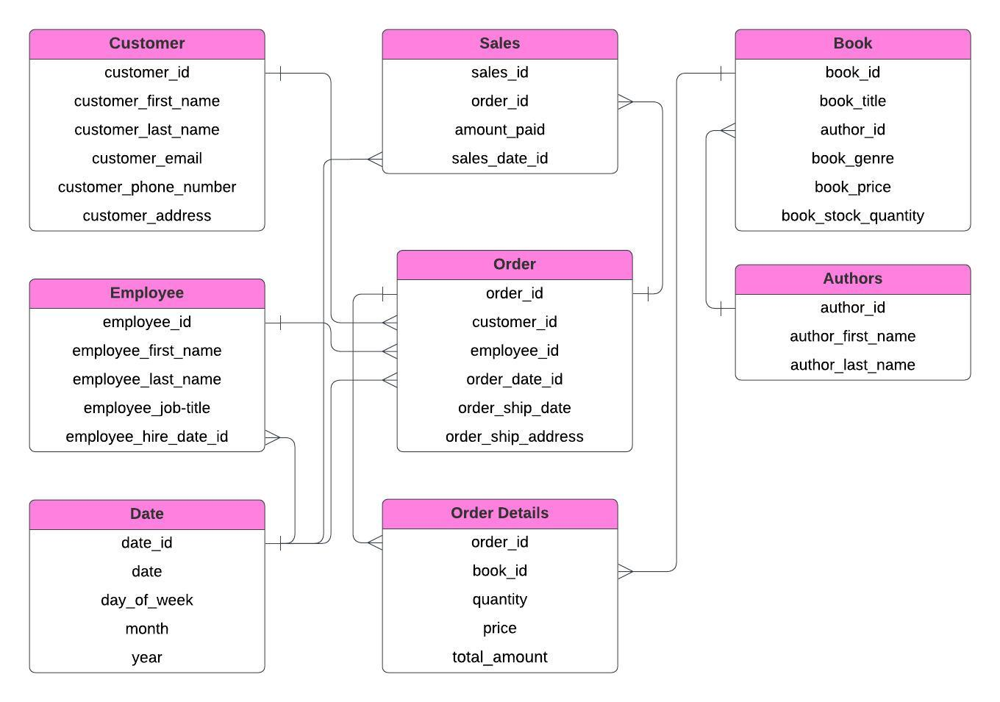
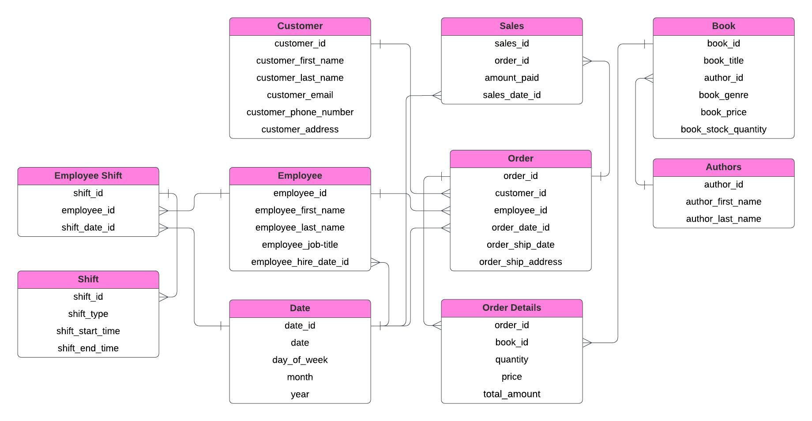
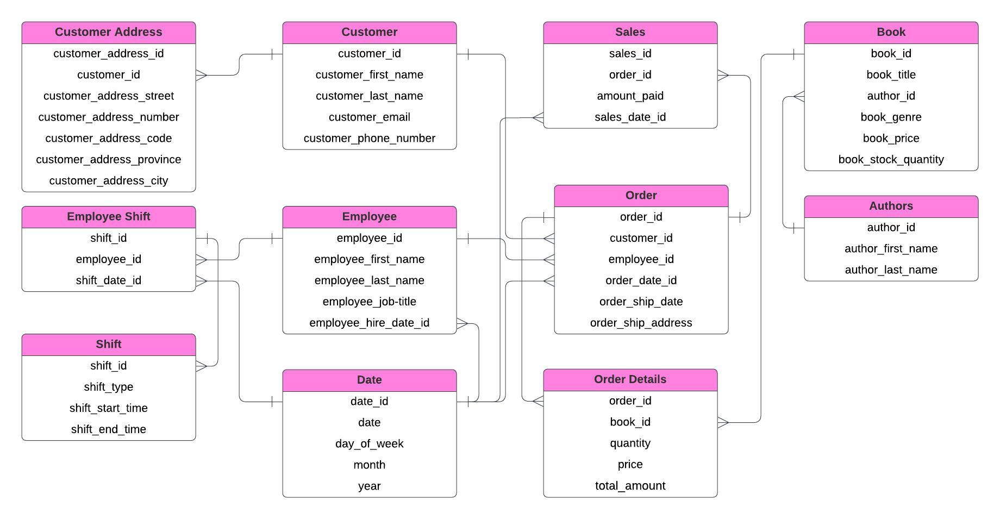
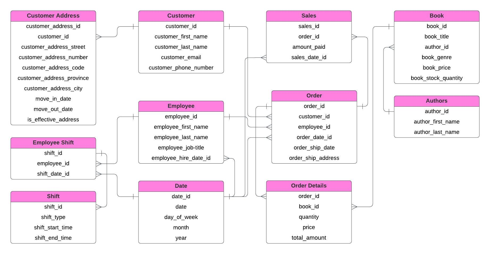

# Assignment 1: Design a Logical Model

## Question 1
Create a logical model for a small bookstore. 📚

At the minimum it should have employee, order, sales, customer, and book entities (tables). Determine sensible column and table design based on what you know about these concepts. Keep it simple, but work out sensible relationships to keep tables reasonably sized. Include a date table. There are several tools online you can use, I'd recommend [_Draw.io_](https://www.drawio.com/) or [_LucidChart_](https://www.lucidchart.com/pages/).

## Answer 1



## Question 2
We want to create employee shifts, splitting up the day into morning and evening. Add this to the ERD.

## Answer 2



## Question 3
The store wants to keep customer addresses. Propose two architectures for the CUSTOMER_ADDRESS table, one that will retain changes, and another that will overwrite. Which is type 1, which is type 2?

_Hint, search type 1 vs type 2 slowly changing dimensions._

Bonus: Are there privacy implications to this, why or why not?
```
Your answer...

1. Type 1 slowly changing dimensions (overwriting Changes) - CUSTOMER_ADDRESS table will store only the current address of each customer. When an address changes, the new address will overwrite the old one.



2. Type 2 slowly changing dimensions (Retaining Changes) - each time a customer’s address changes, a new record is added to the CUSTOMER_ADDRESS table to preserve the history of all previous addresses.



Bonus: Yes, there are potential privacy concerns. Type 1 SCD carries a lower privacy risk since the old address is overwritten, meaning there’s no long-term storage of historical data. This minimizes the chance of exposing previous addresses. In contrast, Type 2 SCD poses a higher privacy risk because it retains a full history of addresses, potentially storing sensitive information indefinitely. If the data is breached or misused, it could expose personal history that individuals may want to keep private.
```

## Question 4
Review the AdventureWorks Schema [here](https://imgur.com/a/u0m8fX6)

Highlight at least two differences between it and your ERD. Would you change anything in yours?
```
Your answer...

1. AdventureWorks has a logical division of database tables depending on department functions, which is more complicated. More detailed entities describe one entity for things like sales or employees.
2. The AdventureWorks schema has a separate AddressType table to categorize addresses (like home, business, and billing). This organization makes it easier to add new address types without changing the main address table.
3. In AdventureWorks, the Employee table has extensive data beyond the basic employee info. It includes fields for position details, management hierarchy, and employment status.
4. AdventureWorks contains taxation and pricing details and fields such as TaxAmount, Freight, and SubTotal.
5. At the moment, I would add to my ERD description and rewrite tables (add more details) for sales and orders, which will be more useful for business purposes.
```

# Criteria

[Assignment Rubric](./assignment_rubric.md)

# Submission Information

🚨 **Please review our [Assignment Submission Guide](https://github.com/UofT-DSI/onboarding/blob/main/onboarding_documents/submissions.md)** 🚨 for detailed instructions on how to format, branch, and submit your work. Following these guidelines is crucial for your submissions to be evaluated correctly.

### Submission Parameters:
* Submission Due Date: `September 28, 2024`
* The branch name for your repo should be: `model-design`
* What to submit for this assignment:
    * This markdown (design_a_logical_model.md) should be populated.
    * Two Entity-Relationship Diagrams (preferably in a pdf, jpeg, png format).
* What the pull request link should look like for this assignment: `https://github.com/<your_github_username>/sql/pull/<pr_id>`
    * Open a private window in your browser. Copy and paste the link to your pull request into the address bar. Make sure you can see your pull request properly. This helps the technical facilitator and learning support staff review your submission easily.

Checklist:
- [ ] Create a branch called `model-design`.
- [ ] Ensure that the repository is public.
- [ ] Review [the PR description guidelines](https://github.com/UofT-DSI/onboarding/blob/main/onboarding_documents/submissions.md#guidelines-for-pull-request-descriptions) and adhere to them.
- [ ] Verify that the link is accessible in a private browser window.

If you encounter any difficulties or have questions, please don't hesitate to reach out to our team via our Slack at `#cohort-4-help`. Our Technical Facilitators and Learning Support staff are here to help you navigate any challenges.
